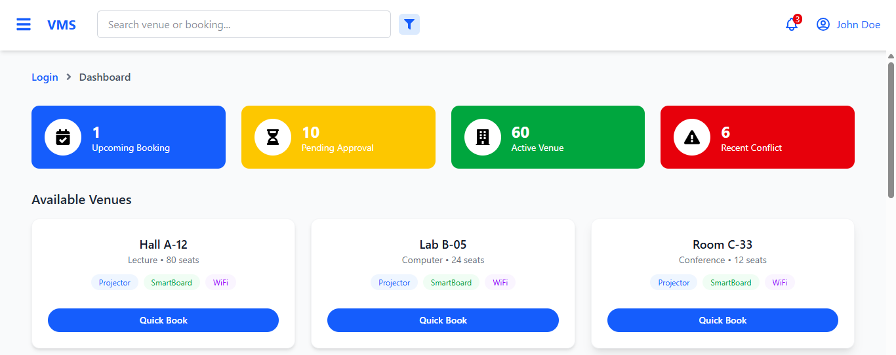
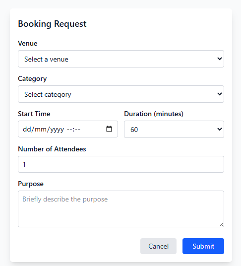

# 📅 Venue Management System (VMS)

> A modern, responsive web platform for managing and streamlining venue bookings. Ideal for schools, organizations, and event planners to handle bookings, schedules, and approvals efficiently.

 <!-- Replace with actual banner if available -->

---

## 🚀 Features

- 📝 Submit venue booking requests
- ✅ Admin approval and rejection of bookings
- ⚠️ Smart conflict detection to prevent double-booking
- 📅 Calendar view of all upcoming events
- 🧑‍💼 User roles (Admin & Normal Users)
- 🔍 Advanced filtering and search
- 📊 Admin dashboard with stats
- 📱 Fully responsive and mobile-friendly
- 🔔 (Optional) Email notifications

---

## 🛠 Tech Stack

| Category    | Tech                          |
|-------------|-------------------------------|
| **Frontend**| React.js, Tailwind CSS        |
| **Backend** | Node.js, Express.js           |
| **Database**| MongoDB *(or MySQL if used)*  |
| **Others**  | JavaScript, HTML5, CSS3       |

---

## 📸 Screenshots

> Add these to a `/screenshots` folder in your project directory.

| Interface       | Preview |
|-----------------|---------|
| Homepage        |  |
| Booking Form    |  |
| Admin Dashboard |  |

---

## ⚙️ Getting Started

### 1. Clone the Repository

```bash
git clone https://github.com/clevensam/VMS.git
cd VMS
### 1.  Backend Setup (Node.js)'

```bash
cd backend
npm install
